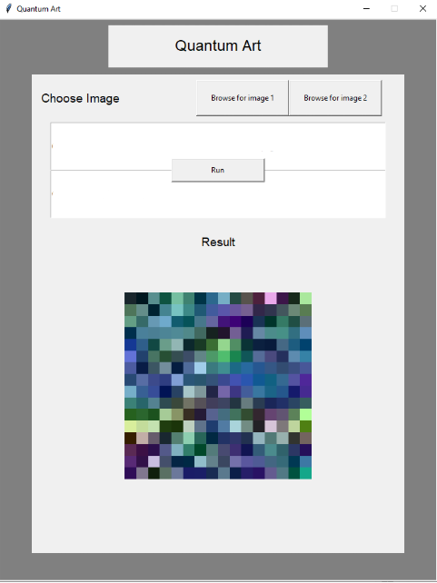

# Quantum Art
### Entry for 2020 Qiskit Summer Jam - NC

### Alex Xu, Achilles Dabrowski, Franklin Boampong, Sam Lamba

Quantum Art is a program that uses Quantum Computing to generate pixel art. By using pixel data from input images, superposition on quantum registers, and a pixel color decoding process, we are able to generate new pixel art. Quantum Art provides a fun interactive method to learn and experiment with the quantum world, and a graphical user interface is developed for easy interaction.

### Links:
- [Slide Deck](https://github.com/achilles-d/qiskitsummerjam/blob/master/Qiskit%20Summer%20Jam%20-%20QLearners%20(Quantum%20Art).pdf)
- [Quick Video Demo](https://www.youtube.com/watch?v=_ItK1MHljmo&feature=youtu.be)

### Instructions:

Make sure to install all required dependencies into your Anaconda Environment:
- Python 3.xx
- Pillow (PIL)
- Matplotlib
- Tkinter
- Numpy
- Sys
- Math
- Image_Merger
- Qiskit (Requires IBM Quantum Experience setup. Can be done by inputting API key and running setup.py that is included).

Next, run **gui.py**. Select images (16x16), and run!
